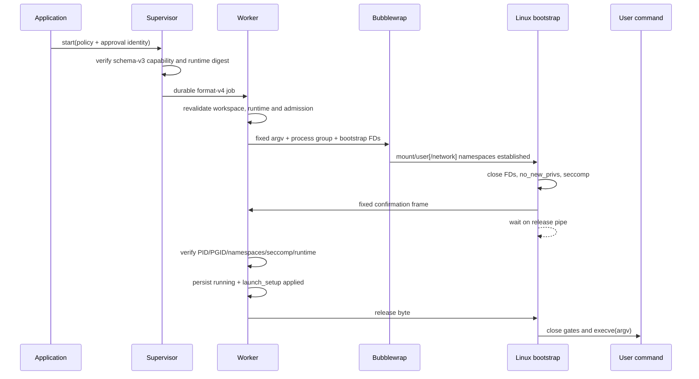

# Koda Phase 4C2B Linux Bubblewrap Design

- Status: Closure candidate — C2B1 through C2B4 implemented; final same-commit
  four-job acceptance pending
- Date: 2026-08-30
- Depends on: completed Phase 4C1 execution policy and Phase 4C2A macOS
  Seatbelt delivery
- Platform order: macOS complete, Linux current, Windows sandboxing deferred

## Outcome

Phase 4C2B makes the existing `read-only` and `workspace-write` execution
profiles enforceable by the native executor on Linux. The selected backend is
Bubblewrap for a read-only-by-default mount view and optional network
namespace, followed by a Koda-owned in-process bootstrap that applies
`no_new_privs`, seccomp, namespace verification, and the existing two-way user
code release gate.

The design preserves the existing direct-argv, explicit-environment,
POSIX-process-group, Pipe, PTY, background-job, attachment, timeout,
cancellation, durable restart, approval, and retained-evidence contracts. A
protected policy is available only after a real self-test through the exact
Bubblewrap executable and the complete Koda bootstrap succeeds. There is no
automatic fallback to Landlock or unconfined execution.

The default `unconfined` profile remains available and visibly unconfined.
macOS continues to use Seatbelt. Windows and the TypeScript backends continue
to reject protected profiles until their own implementation is complete.

## Decision summary

1. Bubblewrap is the primary and only Phase 4C2B Linux filesystem sandbox.
2. A mount namespace exposes `/` read-only and reopens only the canonical
   workspace and private job scratch for `workspace_write`.
3. `network = deny` combines a new network namespace with Koda-owned seccomp
   rules that deny socket creation and relevant alternate kernel entry points.
4. The inner Koda bootstrap, not Bubblewrap output alone, confirms the active
   namespaces, `no_new_privs`, seccomp mode, PID, and process group.
5. User code remains stopped until the Worker verifies the confirmation,
   durably publishes applied evidence, and releases the second gate.
6. Phase 4C2B does not introduce a PID namespace. Existing POSIX process-group
   supervision remains the process ownership boundary.
7. Bubblewrap is selected only through a frozen explicit absolute path or
   fixed system candidates. Koda does not search ordinary `PATH`, download a
   binary, invoke a package manager, or silently change backend.
8. Landlock remains a possible later compatibility backend, not a fallback in
   this slice.
9. Native protocol version 4, durable format version 4, and execution-security
   schema version 3 make the new capability incompatible by construction with
   binaries that do not understand it.
10. Windows sandbox work remains deferred; Windows CI is a regression gate,
    not evidence of Linux or Windows sandbox enforcement.

## Why Bubblewrap

Koda needs an unprivileged sandbox for arbitrary local CLI programs while
preserving ordinary Linux toolchains. Bubblewrap constructs a mount namespace
whose visible paths and mount permissions are selected by the caller. It also
supports user, network, IPC, and PID namespaces and accepts a precompiled
seccomp program. Bubblewrap is a mechanism, not a policy; Koda therefore owns
the complete fixed argument builder, validation, inner bootstrap, evidence,
and test matrix.

OpenAI Codex currently uses Bubblewrap as its default Linux filesystem sandbox,
with a read-only root and explicitly reopened writable paths. Its former
Landlock path remains an explicit legacy fallback. Koda adopts the same primary
mechanism but retains its own smaller policy model, durable Worker architecture,
two-way launch gate, and strict no-fallback rule.

Landlock plus seccomp would integrate with fewer process-launch changes and
would avoid an external executable. It was not selected as the primary backend
because kernel ABI differences complicate a uniform guarantee and because the
current Codex-style direction toward nested read-only or denied paths is better
served by a concrete mount view. A dynamic Bubblewrap/Landlock fallback was
also rejected: it would double capability, evidence, grant, failure, and CI
matrices before Koda has a product requirement for that compatibility layer.

Authoritative references:

- [Bubblewrap README](https://github.com/containers/bubblewrap/blob/main/README.md)
- [Bubblewrap option implementation](https://github.com/containers/bubblewrap/blob/main/bubblewrap.c)
- [Linux seccomp documentation](https://docs.kernel.org/userspace-api/seccomp_filter.html)
- [Linux Landlock documentation](https://www.kernel.org/doc/html/latest/userspace-api/landlock.html)
- [OpenAI Codex Linux sandbox](https://github.com/openai/codex/blob/main/codex-rs/linux-sandbox/README.md)

## Scope

Phase 4C2B includes:

- strict TypeScript and Rust execution-capability schema version 3;
- a retained Linux runtime descriptor and deterministic capability digest;
- native executor protocol version 4;
- durable manifest/state format version 4;
- compatibility reads for durable formats 1 through 3;
- frozen Bubblewrap path selection and binary identity validation;
- a real startup probe through the exact selected executable;
- a fixed Bubblewrap mount/user/network namespace builder;
- an internal Linux sandbox bootstrap;
- `PR_SET_NO_NEW_PRIVS` and Koda-owned seccomp filters;
- a fixed confirmation frame and two-way release handshake;
- identical protected Pipe and PTY launch paths;
- private `workspace_write` scratch and filtered temp environment;
- durable applied evidence through foreground, background, attachment, resize,
  timeout, cancellation, Worker loss, and Supervisor restart flows;
- evidence-derived approval, result, event, app-server, CLI, and TUI reporting;
- deterministic fault injection and real Linux acceptance;
- a dedicated required `linux-native` CI job.

## Non-goals

Phase 4C2B does not add:

- PID namespaces or a `process_isolation = required` implementation;
- cgroup resource quotas or denial-of-service guarantees;
- domain, address, protocol, or port allowlists;
- managed network proxies;
- read privacy for the workspace or the rest of the host filesystem;
- secret injection, output redaction, or credential brokerage;
- provider, MCP-server, or plugin sandboxing;
- shell strings, pipelines, redirection, or command substitution;
- nested path-specific read/write/deny rules;
- automatic package installation or Bubblewrap download;
- a bundled Bubblewrap release artifact;
- Landlock fallback;
- WSL1 support;
- Windows sandbox enforcement.

`workspace_write` is a path-based authority. A process may write through paths
rooted in the canonical workspace or scratch. A pre-existing hard link inside
the workspace still aliases the same inode as any outside name for that inode;
Bubblewrap does not copy or de-alias it. Phase 4C2B will document and test the
path guarantee but does not claim inode-level separation from pre-existing hard
links. Closing that gap would require a different mutation architecture, such
as a copy-on-write workspace plus verified commit, and remains later work.

## Threat model

The following inputs are untrusted:

- repository content, including executable files and symlinks;
- model output and tool arguments;
- project instructions, Skills, plugins, and MCP content;
- the command argv and the code run by that command;
- files the command can read from the workspace.

The following remain trusted:

- the Koda binary and native executor installation;
- the user who starts Koda and supplies its startup environment;
- a Bubblewrap executable explicitly selected by that user;
- fixed system Bubblewrap locations that pass ownership, permission, identity,
  and behavior checks;
- the operating-system kernel and its namespace/seccomp implementation.

The current user can always modify files and configuration outside Koda and is
not treated as an adversary. The sandbox protects that user's ambient filesystem
and network authority from approved but untrusted command code. It does not
attempt to protect against kernel compromise or a malicious host administrator.

## Ten moving pieces

The implementation is intentionally limited to ten principal components:

1. execution-security v3 TypeScript schema and canonical encoder;
2. matching Rust capability/evidence schema and golden fixtures;
3. Linux sandbox runtime descriptor and binary resolver;
4. real Linux capability probe;
5. fixed Bubblewrap command builder;
6. inner `linux-sandbox-bootstrap` command;
7. seccomp filter builder and installer;
8. Worker confirmation/release integration;
9. evidence-derived client projection;
10. native Linux acceptance and CI gate.

## Bubblewrap discovery and identity

Resolution occurs once when the native Supervisor starts, before it advertises
execution capability. The candidate order is:

1. `KODA_BWRAP_PATH`, if supplied by the trusted host;
2. `/usr/bin/bwrap`;
3. `/bin/bwrap`;
4. unavailable.

Koda never searches the inherited `PATH`. The explicit override must be an
absolute path. Each candidate is canonicalized, must resolve to a regular
executable file, and must not be group- or world-writable. Fixed system
candidates must be owned by root. An explicit override may be owned by root or
the current user because the host supplying that override is trusted. The
resolved target, not an unresolved symlink, is inspected and executed.

The Supervisor records a bounded runtime descriptor:

```text
schema_version
canonical_path
device
inode
size
mtime_ns
sha256
version
probe_revision
```

The descriptor contains no environment values or repository paths. Version
output is UTF-8, line-bounded, and normalized before it enters capability
evidence. The SHA-256 covers the executable bytes. Device, inode, size, and
mtime are retained as fast identity checks; SHA-256 remains authoritative.

The Worker reopens and revalidates the selected executable before every
protected launch. A descriptor mismatch returns `EXECUTION_POLICY_CHANGED`
before Bubblewrap or user code starts. The runtime descriptor participates in
the capability digest, so an exact-command grant prepared against a previous
binary cannot authorize the changed runtime.

Automatic download and bundling remain Phase 4E supply-chain work. A future
bundle must be signed, version-pinned, integrity-checked, and represented by a
new probe/runtime revision. It cannot be introduced as a silent fallback to the
Phase 4C2B contract.

## Execution capability schema version 3

The strict Linux capability shape is conceptually:

```json
{
  "schema_version": 3,
  "platform": "linux",
  "backend": "native_posix",
  "sandbox_runtime": {
    "schema_version": 1,
    "mechanism": "linux_bubblewrap",
    "canonical_path": "/usr/bin/bwrap",
    "device": "bounded-decimal",
    "inode": "bounded-decimal",
    "size": 123456,
    "mtime_ns": "bounded-decimal",
    "sha256": "64-lowercase-hex",
    "version": "bubblewrap 0.x",
    "probe_revision": 1
  },
  "filesystem": {
    "supported": ["unrestricted", "read_only", "workspace_write"],
    "mechanism": "linux_bubblewrap_mount_namespace"
  },
  "network": {
    "supported": ["inherit", "deny"],
    "mechanism": "linux_network_namespace_seccomp"
  },
  "process_isolation": {
    "supported": ["inherit"],
    "mechanism": "none"
  },
  "environment": {
    "supported": ["explicit"],
    "mechanism": "explicit_environment",
    "layer": "application"
  },
  "supervision": {
    "mechanism": "posix_process_group",
    "layer": "os",
    "durable": true
  }
}
```

Exact numeric identity fields use bounded decimal strings where JavaScript
cannot safely preserve the complete host value. Canonical field order and
spelling are shared by TypeScript and Rust golden fixtures. Unknown fields,
unknown enum values, unsafe integers, non-canonical paths, oversized strings,
future schema versions, and incorrect field order in canonical fixtures fail
closed.

The runtime descriptor must also be retained inside schema-v3 policy snapshots.
This is required because a durable record must reconstruct and verify its
original capability digest without consulting the current host or assuming the
current Bubblewrap binary is the historical one.

## Evidence lifecycle

Admission retains:

- the frozen execution policy and policy digest;
- platform `linux` and backend `native_posix`;
- the complete bounded sandbox runtime descriptor;
- the capability digest;
- requested filesystem/network dimensions;
- expected mechanisms;
- `not_applied` evidence for requested controls.

Launch setup changes requested dimensions to `applied` only after the inner
bootstrap confirmation and Worker checks succeed:

```text
filesystem:
  status: applied
  mechanism: linux_bubblewrap_mount_namespace
  layer: os

network (when deny was requested):
  status: applied
  mechanism: linux_network_namespace_seccomp
  layer: os
```

`network = inherit` remains `not_requested`; Koda does not claim that the
network namespace or seccomp denied network. `process_isolation = inherit`
also remains `not_requested`. User namespaces and mount namespaces used to
construct the filesystem view are not reported as a PID/process namespace.

The user-facing summary derives from retained evidence:

```text
expected OS sandbox: Linux Bubblewrap + seccomp
OS sandbox: Linux Bubblewrap + seccomp
OS sandbox: evidence unavailable
```

The summary must not infer Linux protection from the host platform, selected
profile, executable name, or Supervisor version. It names the active sandbox
only when every requested schema-v3 dimension has matching applied evidence.

## Protocol and durable compatibility

The native client/Supervisor protocol moves from version 3 to version 4. A
client offers only the versions it fully validates. A version-3 client cannot
parse execution-security v3 and must receive `INCOMPATIBLE_PROTOCOL` rather
than a partial capability or fallback backend.

The durable store moves from format 3 to format 4:

- format 1 remains legacy unknown;
- format 2 accepts only execution-security schema 1;
- format 3 accepts schema 1 and macOS schema 2 according to its existing rules;
- format 4 accepts schema 1, macOS schema 2, and Linux schema 3;
- no read upgrades an older manifest, state, or security snapshot;
- a format-4 reader verifies the retained Linux runtime descriptor and
  reconstructs the original capability digest from it;
- an older binary encountering format 4 leaves it in place and returns an
  incompatible/future-format error; it never quarantines or rewrites it merely
  because it is newer.

The internal Supervisor/Worker protocol is bumped only if the confirmation or
Worker control wire actually changes. Its version is independent of the public
native protocol. The design prefers a new fixed Linux confirmation frame over
adding optional fields to the macOS frame.

App-server protocol version 15 already transports the discriminated execution
security snapshot. It needs a version bump only if a strict existing client
cannot accept the new schema-v3 union under the current application protocol
rules. That decision is made in C2B1 through compatibility tests rather than
assumed here.

## Fixed Bubblewrap policy

The builder receives only trusted typed inputs:

- resolved Bubblewrap executable identity;
- current Koda executable path;
- canonical workspace and cwd;
- private job scratch path, when present;
- policy enum values;
- fixed inherited descriptor numbers;
- direct user argv after the `--` delimiter.

The model never supplies a Bubblewrap flag, mount source, mount destination,
namespace option, bootstrap argument, seccomp program, or environment key.

The initial builder is equivalent to:

```text
<trusted-bwrap>
  --die-with-parent
  --unshare-user
  --disable-userns
  --unshare-ipc
  --cap-drop ALL
  --ro-bind / /
  --remount-ro /
  --dev /dev
  --remount-ro /dev
  --remount-ro /dev/shm
  --ro-bind /run /run
  [--bind <workspace> <workspace>]
  [--bind <scratch> <scratch>]
  [--unshare-net]
  --chdir <cwd>
  --
  <current-koda-exec>
  linux-sandbox-bootstrap
  <fixed internal descriptor arguments>
  --
  <user argv>
```

The bracketed writable binds are present only for `workspace_write`.
`--unshare-net` is present only for `network = deny`. The actual implementation
may add fixed compatibility flags only when the startup probe proves identical
security semantics and the probe revision changes.

Koda does not pass `--not-a-security-boundary`, `--unshare-user-try`,
`--unshare-cgroup-try`, or any other best-effort option. A required setup step
either succeeds or the protected command does not start.

The first slice does not use `--unshare-pid`, `--as-pid-1`, or `--new-session`.
PID namespaces would alter process observation and reaping. A new session would
alter current PTY/process-group behavior. `TIOCSTI` is denied by the inner
seccomp filter instead, and PTY escape behavior is covered by native tests.

The C2B2 prototype retains the host `/proc` view beneath the read-only root and
constructs Bubblewrap's fixed minimal `/dev` view so ordinary device access
such as `/dev/null` remains usable without importing arbitrary host device
mounts. Fixed remounts make `/`, `/dev`, and `/dev/shm` read-only. Because
Ubuntu commonly exposes `/run` as an independent tmpfs child mount, a fixed
read-only bind closes it explicitly instead of assuming the root remount is
recursive. This also works when `/run` is an ordinary directory. The resulting
mount plan closes writable child mounts such as `/dev/shm`, `/run`, and
`/var/tmp` before the validated workspace/scratch binds are reopened. The
startup probe verifies those locations cannot become general writable
temporary storage. `/proc` is used only for namespace, process-group, and
descriptor verification; it does not count as process isolation and is not
presented that way.

## Filesystem semantics

For `read_only`:

- the visible host root is mounted read-only;
- the canonical workspace remains readable but read-only;
- cwd must remain beneath the canonical workspace;
- no private scratch grant is created;
- filtered temp variables cannot point to a writable external path;
- inherited file descriptors cannot carry hidden write authority.

For `workspace_write`:

- the root begins read-only;
- the canonical workspace is rebound read-write at the same path;
- one validated per-job mode-0700 scratch directory is rebound read-write;
- `TMPDIR`, `TMP`, and `TEMP` all point to that scratch directory;
- scratch is part of the durable job lifecycle and is removed only by verified
  job retention cleanup;
- paths outside those two writable roots remain read-only through every alias
  visible in the mount namespace, subject to the documented pre-existing
  hard-link limitation.

Both workspace and scratch are canonicalized before approval. The Worker
revalidates file type, ownership, permissions, identity, and containment before
launch. Symlinked workspace/scratch roots, moved roots, missing targets,
mount-point changes, or path identity changes fail before Bubblewrap starts.

The root read-only mount prevents a workspace symlink from granting writes to
an external target. A writable bind is never created from a model-supplied path.

## Network and seccomp semantics

For `network = inherit`, Koda does not create a network namespace and does not
install the network-deny seccomp rules. The bootstrap still applies
`no_new_privs` and the fixed baseline hardening required by the Bubblewrap
contract.

For `network = deny`:

- Bubblewrap creates a new network namespace;
- the bootstrap installs a seccomp filter that denies new socket and socketpair
  creation across supported architectures;
- alternate kernel entry points capable of creating or connecting sockets,
  including relevant io_uring setup/operations, are denied or the platform is
  declared unsupported;
- no inherited socket descriptor is allowed through the descriptor whitelist;
- pathname and abstract Unix sockets are unavailable because user code cannot
  create the socket endpoint needed to connect;
- TCP, UDP, raw, netlink, and packet sockets are unavailable;
- denial uses a stable errno rather than killing the process where practical,
  so callers can report a normal permission error.

Seccomp is not described as a complete sandbox. It complements the mount and
network namespaces. Filter generation is architecture-specific and fail-closed:
an unsupported architecture or syscall table does not advertise protected
network capability.

The baseline filter also denies `TIOCSTI` and prevents creation or entry into
additional user namespaces after Bubblewrap setup. It must not block the
existing direct process, PTY, signal, timeout, or language-runtime operations
covered by acceptance.

## Bootstrap and confirmation protocol

The Worker creates distinct fixed channels for:

- sandbox confirmation from the inner bootstrap;
- user-code release from the Worker;
- optional bounded Bubblewrap status/identity output if required by the
  prototype.

The internal bootstrap validates that its inherited descriptors are the exact
expected pipe types, are not standard descriptors, and have close-on-exec
semantics appropriate to their stage. It closes every descriptor except
standard input/output/error and the active bootstrap descriptors. The release
and confirmation descriptors are closed before user `execve`.

The fixed confirmation frame contains only bounded binary fields:

```text
magic/version
bootstrap pid
process group id
mount namespace device/inode
user namespace device/inode
network namespace device/inode
no_new_privs status
seccomp mode/status
policy/runtime confirmation digest
```

The frame contains no path, argv, environment, or error text. Errors use fixed
codes and bounded diagnostics outside the durable security object.

The Worker verifies:

1. the spawned Bubblewrap process remains in the owned process group;
2. the confirmed bootstrap PID is live and belongs to that process group;
3. the mount and user namespaces differ from the Worker namespaces;
4. `network = deny` has a distinct network namespace;
5. `network = inherit` has the expected inherited network namespace;
6. `no_new_privs` and the expected seccomp mode are active;
7. the confirmation digest matches the prepared policy, capability, runtime,
   and fixed builder revision;
8. the Bubblewrap executable identity is still current;
9. the durable command start identity has not changed.

Only after all checks pass does the Worker persist `launch_setup` evidence and
the running state. Only after that durable write succeeds does it write the
release byte. Closing the release pipe without that byte causes the bootstrap
to exit without executing user code.

## Launch sequence



Pipe and PTY modes diverge only in their existing standard-descriptor and
controlling-terminal setup. They do not have separate sandbox builders,
seccomp filters, evidence rules, or confirmation semantics.

## Process supervision and PTY behavior

Bubblewrap is launched inside the job's existing POSIX process group. The
Worker retains the process-group identity used for timeout, cancellation,
failure, and terminal cleanup. No shell process is added.

The C2B2/C2B3 prototype must establish Bubblewrap's exact parent/child behavior
and record both the outer supervised PID and confirmed inner bootstrap identity
where necessary. A confirmed PID is never accepted merely because it was
reported over an inherited pipe; `/proc` identity and process-group membership
must match.

For PTY jobs:

- the existing Worker-owned controlling terminal is created before Bubblewrap;
- only the slave terminal descriptors needed by the command are inherited;
- the inner command remains reachable through the existing PTY attachment and
  fenced input APIs;
- resize signals and dimensions must reach the final command;
- detach does not terminate a background job;
- Supervisor restart reconnects to the Worker without replaying Bubblewrap or
  user code;
- `TIOCSTI` cannot inject input into a more privileged terminal context;
- applied sandbox evidence remains byte-for-byte identical through the full
  lifecycle.

`--die-with-parent` is defense in depth for loss of the Worker/Bubblewrap chain.
The authoritative cleanup remains the verified POSIX process group. A change in
Bubblewrap behavior that escapes the group or leaves surviving descendants
fails native acceptance and cannot advertise capability.

## Environment and descriptor policy

The existing explicit environment allowlist remains authoritative. Bubblewrap
does not reconstruct environment from the host. The command receives only the
environment prepared by Koda plus fixed sandbox-required variables.

For `workspace_write`, the three temp variables are replaced with the private
scratch path. For `read_only`, no external writable temp location is inherited.
Future secret environment values remain out of scope and are never introduced
by the sandbox layer.

The descriptor whitelist is mode-specific and fixed. Before user `execve`, it
contains only:

- stdin, stdout, stderr;
- no confirmation/release/status descriptor;
- no Bubblewrap control descriptor;
- no native Supervisor/Worker control socket;
- no directory descriptor granting access outside the mount policy;
- no inherited network or Unix socket.

Tests inspect `/proc/self/fd` inside the sandbox and attempt to use every visible
non-standard descriptor. A descriptor count or type mismatch fails before
release.

## Failure semantics

| Failure                                   | Required result                                             |
| ----------------------------------------- | ----------------------------------------------------------- |
| No candidate Bubblewrap                   | `EXECUTION_POLICY_UNAVAILABLE` before approval/job          |
| Invalid path/owner/mode/type              | unavailable; never execute candidate                        |
| Binary identity changed after preparation | `EXECUTION_POLICY_CHANGED` before launch                    |
| Version/probe output malformed            | unavailable with bounded diagnostic                         |
| User/mount/network namespace unavailable  | unavailable; no best-effort fallback                        |
| `no_new_privs` or seccomp unsupported     | unavailable for protected policy                            |
| Self-test allow operation fails           | capability not advertised                                   |
| Self-test deny operation succeeds         | capability not advertised                                   |
| Workspace/scratch identity changed        | start failure before Bubblewrap                             |
| Bubblewrap exits before confirmation      | `start_failed`; admission evidence retained                 |
| Confirmation frame malformed/partial      | terminate group; no applied evidence                        |
| PID/PGID/namespace mismatch               | terminate group; no release                                 |
| Worker dies before release                | release pipe closes; bootstrap exits; no user code          |
| Durable applied-evidence write fails      | no release; conservative terminal state                     |
| Fault after release                       | retain applied evidence and use ordinary ownership recovery |
| Timeout/cancel/output failure             | terminate and confirm complete process group                |
| Supervisor restart                        | reconnect to Worker; never replay sandbox or user command   |
| Future durable format                     | leave in place; report incompatibility                      |

All public errors use stable codes and bounded messages. Raw Bubblewrap stderr,
paths beyond already authorized public fields, environment data, `/proc`
contents, and seccomp program bytes do not enter execution-security evidence.

## Capability self-test

The Supervisor advertises schema-v3 capability only after one bounded test
through the exact selected Bubblewrap binary and current Koda bootstrap proves:

1. normal executable and library reads work;
2. a workspace test path is read-only under `read_only`;
3. a prepared workspace path and private scratch are writable under
   `workspace_write`;
4. an external path remains read-only under `workspace_write`;
5. network-deny blocks TCP, UDP, and Unix-socket creation/use;
6. network-inherit reaches a local test endpoint;
7. mount and user namespaces differ from the probe parent;
8. the deny profile has a distinct network namespace;
9. `no_new_privs` and seccomp are active in the bootstrap;
10. nested user namespace creation and `TIOCSTI` fail;
11. sandbox confirmation is produced internally;
12. closing the release channel prevents the marker user command from running.

The probe uses private temporary paths outside any repository, fixed commands,
loopback-only local servers, strict timeouts, bounded output, and complete
cleanup. It does not trust `bwrap --version` as proof of enforcement.

`KODA_REQUIRE_LINUX_BUBBLEWRAP=1` makes startup fail when the probe does not
activate schema-v3 capability. CI uses this mode. Normal unconfined startup may
continue with schema-v1 capability when no protected profile was selected, but
the missing Linux sandbox must remain visible in diagnostics and protected
profiles remain unavailable.

## Client projection

The application, command runners, grants, results, events, native job summaries,
interactive process summaries, and app-server responses already carry a typed
security snapshot. Phase 4C2B extends the discriminated union rather than adding
Linux-only side channels.

The shared sandbox-summary function becomes mechanism-driven:

- schema 1 or unrequested controls: `OS sandbox: none`;
- schema 2 admission: expected macOS Seatbelt;
- schema 2 applied: macOS Seatbelt;
- schema 3 admission: expected Linux Bubblewrap + seccomp;
- schema 3 applied: Linux Bubblewrap + seccomp;
- legacy/missing evidence: unknown;
- partial or inconsistent applied evidence: unavailable/corrupt, never a
  positive sandbox claim.

Approval previews name only expected protection. A `process.started` event can
name the active Linux sandbox only with `launch_setup` applied evidence. CLI and
TUI tests use the same schema-v3 fixture as app-server protocol tests.

## Delivery slices

### C2B1: protocol, durable format, and evidence

Status: Complete (2026-08-30)

- Add TypeScript/Rust capability and snapshot schema version 3.
- Add the bounded Linux sandbox runtime descriptor.
- Add deterministic canonicalization and shared golden fixtures.
- Bump native protocol to version 4.
- Bump durable store to format 4.
- Preserve strict reads for formats 1 through 3 and future-format behavior.
- Extend grant/capability fingerprints and mechanism-driven client summaries.
- Do not advertise schema-v3 capability or execute protected Linux jobs yet.

Delivered with strict TypeScript/Rust schema-v3 validation, a versioned and
bounded Bubblewrap runtime descriptor, cross-language canonical bytes and
SHA-256 fixtures, native protocol v4, durable format v4, explicit format 1–3
compatibility, runtime-bound exact-command grants, and mechanism-derived
app-server/CLI/TUI summaries. App-server protocol v15 remains compatible with
the extended discriminated union, so it was not bumped. Linux native runtime
advertisement intentionally remains schema v1 until C2B2 completes its real
probe.

### C2B2: binary trust and real capability probe

Status: Complete (2026-08-30)

- Implement frozen Bubblewrap discovery and identity checks.
- Implement the fixed command builder and inner bootstrap prototype.
- Implement `no_new_privs`, architecture-specific seccomp, and namespace
  identity collection.
- Implement the fixed confirmation frame and release gate in probe mode.
- Run the complete real startup self-test.
- Advertise schema-v3 capability only after the self-test succeeds.
- Keep protected user execution unavailable until C2B3.

Delivered with trusted override/system-path discovery that never searches
`PATH`, canonical owner/mode/type checks, frozen device/inode/size/mtime/SHA-256
and bounded version identity, a typed fixed Bubblewrap builder, minimal
read-only `/dev`, recursive root/temp-path write closure, and a dedicated
synchronous internal-command entry that does not initialize an async runtime
inside seccomp. The architecture-specific bootstrap applies `no_new_privs`,
baseline user-namespace/credential/TIOCSTI rules, and deny-mode socket,
socketpair, and io_uring rules before emitting its fixed PID/PGID/namespace/
security/digest confirmation frame.

The startup self-test runs real `read_only + deny`, `workspace_write + deny`,
and `read_only + inherit` invocations through the selected executable. It
checks normal reads, workspace/scratch writes, external and general-temp write
denial, TCP/UDP/Unix socket denial, loopback inherited networking, namespace
identity, `no_new_privs`, seccomp, nested user namespaces, TIOCSTI, descriptor
closure, and release-channel abort. A verified Supervisor advertises schema v3;
`KODA_REQUIRE_LINUX_BUBBLEWRAP=1` makes failure fatal. C2B2 deliberately keeps
the pre-job protected-start gate closed, while schema-v3 unconfined jobs retain
and reconstruct the frozen capability normally. Protected Pipe/PTY launch and
durable applied evidence remain C2B3.

### C2B3: protected Pipe and PTY enforcement

Status: Complete (2026-08-30)

- Route protected Pipe and PTY starts through the common Linux builder.
- Revalidate workspace, scratch, binary identity, policy, and capability at the
  Worker boundary.
- Persist applied evidence only after confirmation and before release.
- Preserve direct argv, explicit environment, process groups, timeout,
  cancellation, output, PTY, background, and restart behavior.
- Add deterministic faults before spawn, after namespace setup, after seccomp,
  after confirmation, after evidence persistence, and after release.

Delivered through the shared Unix command-start and sandbox-release gates.
Protected Linux Pipe and PTY jobs use the frozen Bubblewrap builder with direct
argv and explicit environment, private validated scratch for `workspace_write`,
and the existing Worker-owned process group or controlling terminal. The Worker
reconstructs the retained schema-v3 capability, revalidates the selected
Bubblewrap executable and launch paths, and verifies the fixed inner bootstrap
confirmation against the outer process group, live bootstrap PID, mount/user/
network namespaces, `no_new_privs`, seccomp mode, policy/capability/runtime
digest, and current executable identity.

Applied filesystem/network/environment/supervision evidence is committed with
the durable `running` transition before the inner release byte is written.
Closing either gate or losing the Worker before that point cannot execute user
code; recovery retains admission-only or applied evidence according to the last
completed durable transition and cleans the verified process group
conservatively. Shared native acceptance now exercises protected Pipe/PTY,
workspace/scratch writes, inherited network, background PTY attach/resize/
detach/restart, and deterministic pre-spawn, namespace, seccomp, confirmation,
evidence, and post-release fault boundaries on Linux-capable hosts.

### C2B4: clients and same-commit acceptance

- Completed preview/result/event/app-server/CLI/TUI schema-v3 reporting tests.
- Added the real side-effect, descriptor, syscall, network, Pipe/PTY,
  background, runtime-replacement, and restart matrices.
- Added and self-tested an inner `PR_SET_PDEATHSIG(SIGKILL)` link so Worker loss
  cannot orphan released user code after Bubblewrap exits with its parent.
- Published the revised execution-security guarantee with explicit limits.
- Added the dedicated `linux-native` CI job with fail-closed capability
  requirements and bounded diagnostics. Repository owners must configure that
  job as a required branch-protection check where branch protection is used.
- Close Phase 4C2B only when the same implementation commit passes shared
  Linux verify, Linux native, macOS native, and Windows native jobs.

## Acceptance matrix

1. `read_only + deny` reads normal files but cannot write workspace, external,
   or temporary paths and cannot use TCP, UDP, raw, netlink, pathname Unix, or
   abstract Unix sockets.
2. `workspace_write + deny` writes the canonical workspace and private scratch
   but cannot open any external path for write, subject to the documented
   pre-existing hard-link alias limitation.
3. `network = inherit` preserves TCP, UDP, and Unix-socket behavior without
   widening either filesystem policy.
4. Pipe and PTY commands enforce identical filesystem/network policy.
5. Background PTYs retain applied schema-v3 evidence through attach, input,
   resize, detach, Supervisor restart, reattach, and completion.
6. Non-whitelisted descriptors and `/proc/self/fd` cannot carry filesystem or
   network authority into user code.
7. io_uring, socketcall where applicable, nested user namespaces, setuid
   transitions, and `TIOCSTI` cannot bypass the selected controls.
8. Missing/replaced Bubblewrap, malformed identity/version, unavailable
   namespace/seccomp, confirmation failure, PID/PGID mismatch, and stale
   capabilities cause no user-code side effect and no applied evidence.
9. Policy/backend/runtime/capability changes invalidate exact-command grants
   before execution.
10. Timeout, cancellation, output failure, root exit, Bubblewrap failure, and
    Worker loss clean up the complete process group or report conservative
    termination uncertainty.
11. Durable formats 1 through 4 remain observable without gaining current
    guarantees; compatible live jobs finish without replay.
12. Default unconfined execution, macOS Seatbelt, provider, recovery, plugin,
    MCP, app-server, CLI, TUI, native POSIX, Job Object, and ConPTY regression
    suites remain green.

## Linux host prerequisites

Koda never installs Bubblewrap, changes kernel namespace policy, disables
AppArmor, or loads a host security profile at runtime. A Linux installation
must provide a trusted Bubblewrap executable at one of the fixed discovery
paths (or through the explicit administrator-selected override) and must allow
that executable to create the user, mount, IPC, and optional network
namespaces used by the verified profiles. If either condition is absent, the
startup probe fails closed and schema-v3 protection is not advertised.

Ubuntu 24.04 restricts unprivileged user namespaces through AppArmor. On a
clean host where no other Bubblewrap profile is attached, the supported setup
is to install Ubuntu's `apparmor-profiles` and `apparmor-utils` packages, place
the packaged `bwrap-userns-restrict` profile under `/etc/apparmor.d`, and load
it with `apparmor_parser`. Koda's CI performs that scoped setup and then runs a
namespace preflight before the full real-probe suite. It does not disable
`kernel.apparmor_restrict_unprivileged_userns` globally. Administrators must
inspect existing profiles before changing a non-clean host because two
profiles targeting `/usr/bin/bwrap` can conflict.

## CI plan

The existing Linux `verify` job is already the shared full-suite gate. C2B2
pins Ubuntu 24.04, installs the distro Bubblewrap and AppArmor tooling, loads
the distro's scoped `bwrap-userns-restrict` profile, performs a fixed namespace
preflight plus a bounded native-executor startup smoke, and runs with
`KODA_REQUIRE_LINUX_BUBBLEWRAP=1`, so schema-v3 advertisement cannot pass from
pure fixtures. Phase 4C2B4 adds a separate `linux-native` job on
`ubuntu-24.04` for the complete protected Pipe/PTY matrix:

1. install the distro Bubblewrap and scoped AppArmor profile explicitly;
2. record `/usr/bin/bwrap` and its version in diagnostics;
3. set `KODA_REQUIRE_LINUX_BUBBLEWRAP=1`;
4. build the current native executor and pinned legacy fixture;
5. run Rust formatting and Clippy with warnings as errors;
6. run native executor and Linux execution-policy acceptance without
   platform-condition skips;
7. fail if protected capability is unavailable;
8. retain bounded failure summaries.

The same commit must also pass:

- `verify` on Linux;
- `macos-native`, including real Seatbelt and legacy compatibility;
- `windows-native`, including Job Object, ConPTY, shared schema, and durable
  compatibility.

Windows remains a regression target only. No Phase 4C2B result is a Windows
sandbox claim.

## Deferred backlog

The following remain explicit later work:

- a signed bundled Bubblewrap artifact and update policy in Phase 4E;
- Landlock compatibility fallback with its own capability/evidence identity;
- nested path-specific read/write/deny mounts and protected `.git` rules;
- hard-link alias isolation or copy-on-write command mutation commits;
- PID namespace/process isolation policy;
- cgroup CPU, memory, process-count, and I/O quotas;
- proxy-only, domain, address, protocol, and port network policies;
- secret injection, redaction, expiry, and audit metadata;
- provider, MCP-server, and plugin isolation;
- shell syntax evaluation;
- WSL-specific support beyond ordinary WSL2 behavior proven by a future job;
- all Windows restricted-token/AppContainer filesystem/network enforcement.

These items do not become complete when Phase 4C2B closes.

## Implementation rules

- Continue on `main` per the project development decision; use another branch
  only for a separately approved major refactor.
- Use strict validators at every protocol and durable boundary.
- Never echo rejected argv, environment, repository content, seccomp bytes, or
  raw Bubblewrap diagnostics into public errors.
- Never use best-effort namespace flags for an advertised capability.
- Never infer applied evidence from a successful exit code.
- Never release user code before applied evidence is durable.
- Never silently fall back to Landlock, TypeScript, or unconfined execution.
- Preserve unrelated user changes and the untracked `.idea/` directory.
